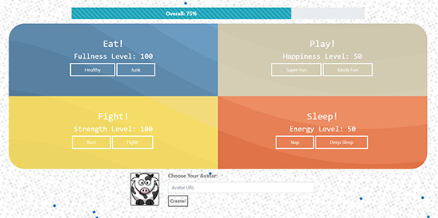

# NSS E12 Exercise - Tamagotchi

## Description:
The objective of the exercise was to create a Tamagotchi site inspired by the popular 90s handheld game. The project was our introduction to Webpack and SCSS. 

## Features:
1. Scores in quardrants are updated on button click.
1. Progress bar is updated dynamically with the average of all four current quadrant scores.
1. User can add custom avatar.
1. If a quadrant score goes to 0, the users pet dies :cry: and the kill screen is displayed giving the user the option to try again. 
1. Project uses HTML, SCSS, Vanilla JS, JQuery, Webpack
1. Project has responsive design.

## Screenshots:
##### Main View

##### User Add Custom Avatar

##### Game Over Screen

## How To Run:
> Project is deployed at [tamagotchi.logandevelopment.io](https://tamagotchi.logandevelopment.io)
